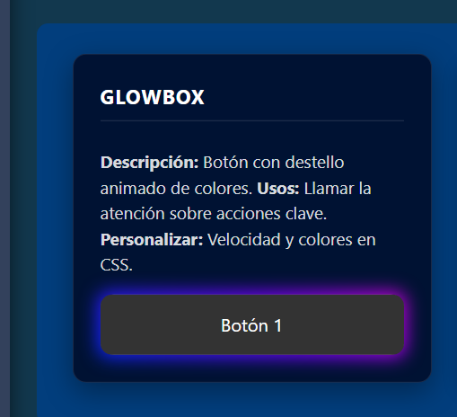
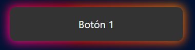
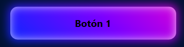
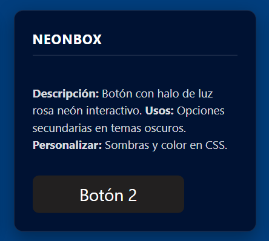
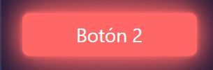

<div align="center">
<br><br>

### Ingenieria en sistemas computacionales

<br>

#### Programación web

#### Tema 2

<br>

#### Actividad 3

# Componente Visual con JS

Sirve para crear componentes visuales como menús desplegables, tooltips y modales. Puedes personalizar el color, tamaño y comportamiento de cada componente.

<br><br><br>

**Docente:**<br>
Ing. Adelina Martínez Nieto

<br><br>

**Estudiantes:**<br>
Cuevas Garcia Andrés

<br><br><br><br><br><br>

Oaxaca de Juarez, Oaxaca.
<br><br>
11 de Julio de 2026

</div>

## Librería de Componentes Visuales - Actividad 3

### Video (Demo Promocional)

<video src="https://drive.google.com/file/d/1QmH_AOZJMd6zTd9FhzgaZYkmFW5ELUDp/view?usp=sharing" controls width="100%"></video>

En este proyecto construyes una librería modular utilizando JavaScript vainilla y CSS moderno. 
Tus componentes visuales son piezas de interfaz reutilizables que el usuario puede ver e interactuar (modales, tooltips, dropdowns, toasts). 
Al separarlos en tu propia librería, puedes inyectarlos en cualquier página HTML con diferente contenido sin tener que reescribir tu lógica ni tus estilos cada vez.

### Problemas que resuelve

Esta librería soluciona los problemas más comunes al construir interfaces de usuario complejas:
- **Redundancia de código:** Evita que tengas que repetir tus estructuras HTML y estilos para elementos comunes en múltiples páginas.
- **Consistencia Visual:** Asegura que todos tus menús, notificaciones y modales compartan las mismas animaciones y tu paleta de colores oscuros con sombreados temáticos (Neón, Glow).
- **Interactividad Accesible:** Facilita la creación de alertas contextuales, información flotante y modales dinámicos en tu web sin depender de frameworks pesados.
- **Experiencia de usuario (UX):** Proporciona retroalimentación visual inmediata a tus usuarios con animaciones fluidas y notificaciones temporales (Toasts).

### Guía de instalación

Para utilizar esta librería en tu propio proyecto, sigue estos sencillos pasos:

1. **Vincula los Estilos:** Agrega la hoja de estilos de tus componentes en el `<head>` de tu archivo HTML.
   ```html
   <link rel="stylesheet" href="./CSS/EstilosComponentes.css">
   ```
2. **Vincula la utilería JS:** Coloca la referencia a tu archivo `LibreriaComponentes.js` al final de tu documento HTML (antes de cerrar el `<body>`):
   ```html
   <script src="./JS/LibreriaComponentes.js"></script>
   ```
3. **Ejecuta la inicialización:** Instancia tus clases en tu script de cierre para dar vida a los componentes.

---

### Botones Interactivos (GlowBox y NeonBox)

Botones interactivos diseñados completamente en CSS que responden a eventos del usuario (`hover`, `active`). Se incluyen en la hoja de estilos `EstilosComponentes.css`.

**GlowBox (Botón 1):**
Tiene una animación constante y un destello colorido.
* Normal: 
* Al pasar el cursor (Hover): 
* Al hacer clic: 

**NeonBox (Botón 2):**
Botón oscuro que reacciona con un halo neón rosa al pasar el cursor.
* Normal: 
* Al pasar el cursor (Hover): 

---

### Componente 1: CustomModal

Crea una ventana emergente interactiva sobre tu contenido. Permite mostrar avisos o insertar formularios HTML de forma limpia.

@param {Object} opciones - Un objeto con los ajustes de tu modal.
@param {string} opciones.titulo - El texto de la cabecera de tu modal.
@param {string} opciones.contenido - El texto o estructura HTML interna de tu modal.
@param {string} opciones.colorTema - Color hexadecimal para la barra superior (ej. `#023E7D`).
@param {string} opciones.claseExtra - Clases CSS adicionales para personalizar tus temas (ej. `modal-glow`, `modal-neon`).

**Captura de pantalla:**


```js
// Instancia un nuevo Modal al hacer clic en tu botón
new CustomModal({
    titulo: "Modal con Estilo Neón",
    
    // Pasa el contenido que inyectarás dinámicamente en tu DOM
    contenido: `<p>¡Hola! Has activado tu modal con estilo Neón.</p>`,
    
    // Agrega una clase extra definida en tu CSS para cambiar los bordes y sombras
    claseExtra: "modal-neon"
});
```

---

### Componente 2: CustomToast

Envía notificaciones dinámicas (alertas de éxito, advertencia o error) que se apilan en tu pantalla y desaparecen solas.

@param {Object} opciones - Configuración de tu alerta.
@param {string} opciones.mensaje - El texto descriptivo de tu alerta.
@param {string} opciones.tipo - El estilo visual de tu notificación (`success`, `error`, `warning`, `info`).
@param {number} opciones.duracion - Milisegundos que dura tu alerta antes de desaparecer (por defecto: `3000`).

**Captura de pantalla:**


```js
// Crea una alerta de éxito cuando realizas una acción exitosa en tu sistema
new CustomToast({
    // Configura el mensaje que quieres mostrar al usuario
    mensaje: "¡Tu acción se realizó correctamente!",
    
    // El tipo determina el color de tu ícono y de tu barra de progreso
    tipo: "success",
    
    // Tu alerta desaparecerá automáticamente tras 3.5 segundos
    duracion: 3500
});
```

---

### Componente 3: CustomDropdown

Crea un menú desplegable asociado a tu botón disparador. Maneja automáticamente los eventos de apertura y se cierra si haces clic fuera de él.

@param {Object} opciones - Configuración de tu menú desplegable.
@param {string} opciones.botonId - El `id` de tu botón que servirá para desplegar la lista.
@param {string} opciones.claseExtra - Clase para aplicar los temas de fondo y bordes (`dropdown-verde`, `dropdown-neon`).
@param {Array} opciones.items - Lista de objetos `{texto, accion}` para configurar los clics de cada opción.

**Captura de pantalla:**


```js
// Inicializa tu menú pasándole el ID de tu botón contenedor
new CustomDropdown({
    botonId: 'btn-dropdown-2',
    
    // Aplica el tema visual oscuro/verde que creaste en tu CSS
    claseExtra: 'dropdown-verde',
    
    // Define las opciones y la función que ejecutarás al hacer clic en ellas
    items: [
        { texto: 'Reportar Error', accion: () => new CustomToast({ mensaje: '¡Fallo!', tipo: 'error' }) }
    ]
});
```

---

### Componente 4: CustomTooltip

Detecta cualquier elemento de tu HTML que posea el atributo `data-tooltip` y crea dinámicamente una etiqueta flotante sobre él cuando pasas el cursor (hover).

@param {Object} opciones - (Opcional) Selector base de los elementos.
Atributos HTML requeridos:
- `data-tooltip="Mensaje..."`: Define el texto de tu etiqueta flotante.
- `data-tooltip-theme="tooltip-neon"`: (Opcional) Define el tema/color de tu recuadro.

**Captura de pantalla:**


```html
<!-- En tu HTML simplemente agregas los atributos data a tu botón o enlace: -->
<button data-tooltip="Información útil" data-tooltip-theme="tooltip-verde">
    Pasa tu cursor
</button>
```

```js
// En tu archivo JavaScript, basta con inicializar la clase una vez al cargar tu página
// para que busque y otorgue interactividad a todos los tooltips de tu documento.
new CustomTooltip();
```